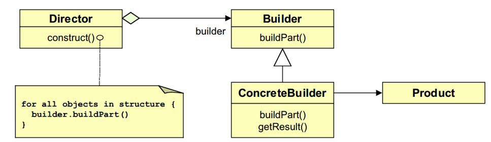
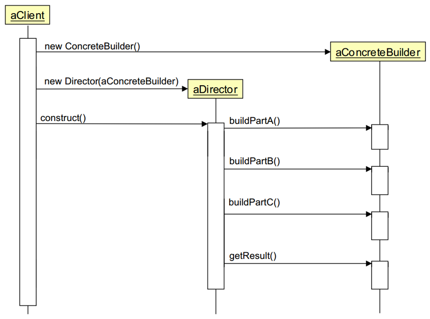
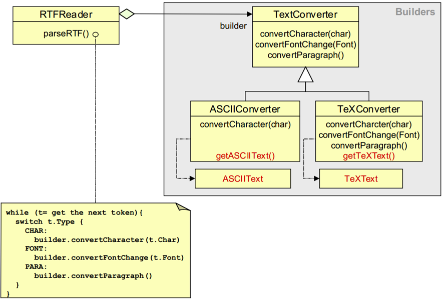
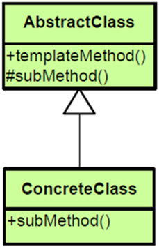
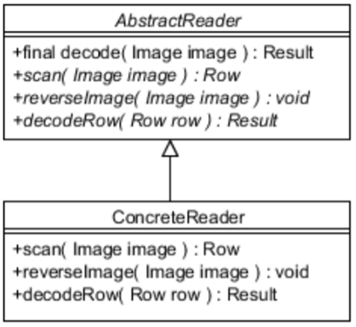
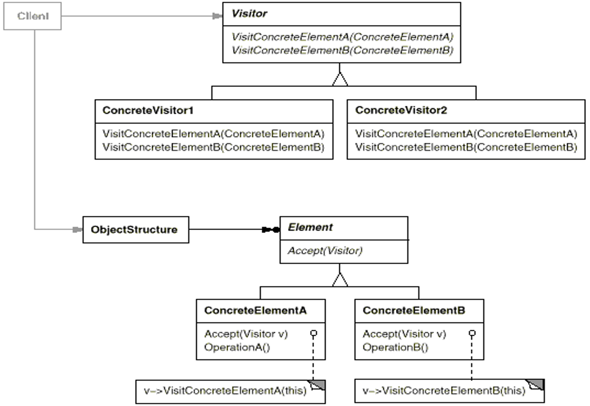
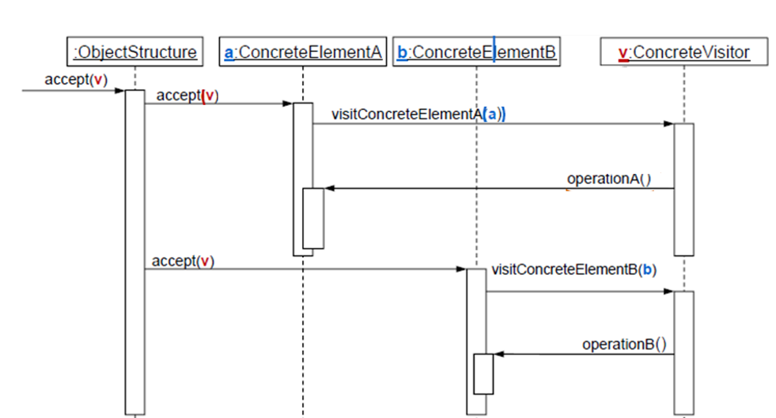
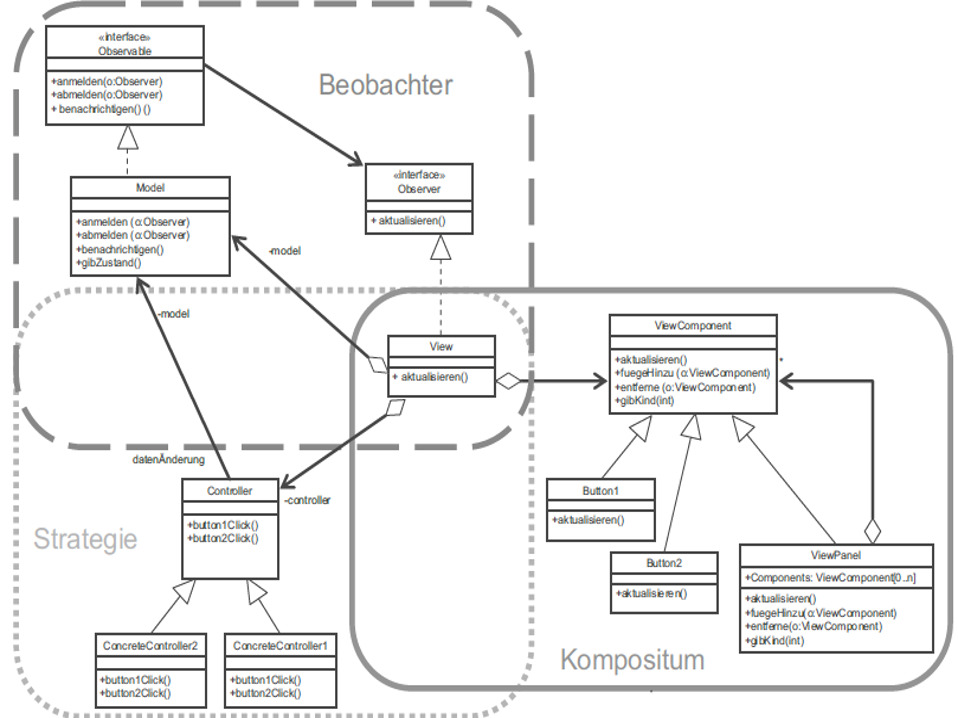
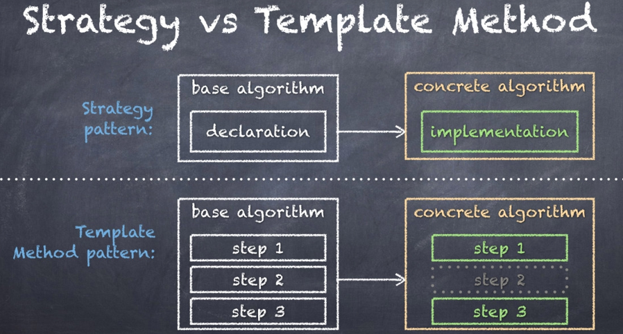

# Entwurfsmuster

### Command
Bei einer Textverarbeitung können viele Funktionen von unterschiedlichen Stellen aus aufgerufen werden, z.B Menü, Button, Popup-Menü bei Rechtsklick, Tastaturkürzel. Diese Funktionen sollen nicht immer neu implementiert werden und zudem rückgängig gemacht werden können. Außerdem soll man die Funktionen mehrfach ausführen können.

**Lösung:**
- Den Befehl in einer Klasse kapseln
- Ein und derselbe Befehl kann von mehreren Stellen aus aufgerufen werden
- Operationen als Objekte mit Methoden execute()/undo() darstellen
- Befehlsobjekte in einer Befehlsgeschichte speichern


#### Verbindung von Observer und Command in Java

- Observer 
	- Buttons, Menü-Einträge und Tasten generieren "ActionEvents"
	- Interface "ActionListener" ist vordefiniert

- Das "ActionListener"-Interface implementieren und dann Instanzen davon bei Buttons, MenuItems etc. registrieren

Elegante Verbindung von Observer und Command

- Commands sind **ActionListener** von Buttons, Menüs, etc.
	- Einheitlicher Aufruf via **actionPerformed(ActionEvent evt)
- Buttons und Menüs sind **PropertyChangeListener** von Commands
	- Aktivierung/Deaktivierung

- Wiederverwendung
	- gleiche **Action** für Menü, Button, Key


#### GoF-Pattern Übersicht


### Adapter

#### Adapter-Zweck

Ein Adapter (Synonym: Wrapper) passt die Schnittstelle einer Klasse an eine andere Schnittstelle an, die von ihren Klienten erwartet wird. Das Adaptermuster lässt Klassen zusammenarbeiten, die wegen inkompatibler Schnittstellen ansonsten dazu nicht in der Lage wären.


- "Adapter" erbt von und verhält sich wie "Ziel" und benutzt die "AdaptierteKlasse"
- Adapter leitet Aufruf der gewünschten Funktionalität an die adaptierte Klasse weiter

#### Objekt-Adapter - Beispiel


#### Klassen-Adapter


### Bridge

Eine Brücke findet Anwendung, wenn
- Abstraktion un Implementierung erweiterbar sein sollen
- eine dauerhafte Verbindung zwischen Abstraktion und Implementierung verhindert werden soll
- Änderungen der Implementierung ohne Auswirkung für den Klienten sein sollen und die Implementierung vor dem Klienten verborben bleiben soll
- die Implementierung gleichzeitig genutzt werden soll


### Factory Method

Die Schnittstelle zur Erstellung eines Objektes ist eine (abstrakte) Methode einer Oberklasse. Die konkrete Implementierung der Erzeugung neuer Objekte findet jedoch nicht in der Oberklasse statt, sondern in von ihr abgeleiteten Unterklassen, die die besagte abstrakte Methode implementieren.


### Abstract Factory

Eine Abstract Factory entkoppelt den Aufrufer von der Implementierung konkreter Produkt-Klassen.

#### Nachteil

Es sind mehr Klassen nötig als beim „Factory Method“-Pattern.

#### Zweck

Sie bietet eine Schnittstelle zum Erzeugen von Familien verwandter Objekte, ohne ihre konkreten Klassen zu benennen.

#### Anwendbarkeit

- Wenn ein System unabhängig davon sein soll, wie seine Produkte erzeugt werden. 
- Wenn ein System mit einer von mehreren Produktfamilien konfiguriert werden soll. 

#### Abstract Factory Pattern


#### Abstract Factory Beispiel


```java
class Factory {
 	public static final int CAR = 0;
 	public static final int MOTORCYCLE = 1;

	public Vehicle createVehicle(int i) {
   		switch(i) {
			case CAR:
    			return new Car();
   			case MOTORCYCLE:
    	 		return new Motorcycle();
    		default:
       			throw new IllegalArgumentException("Wrong vehicle number!");
		}
	}
}
```

```java
interface Vehicle {
    public int getCountOfTires();
    public String getName();
}
```

```java
class Car implements Vehicle {
  	public int getCountOfTires() {
    	return 4;
	}
	public String getName() {
    	return "Car";
  	}
}
```

```java
class Motorcycle implements Vehicle {
  	public int getCountOfTires() {
		return 2;
	}
	public String getName() {
		return "Motorcycle";
	}  
}
```

```java
public class FactoryPattern {
	public static void main(String[] args) {
		Factory f = new Factory();
		Vehicle newCar = f.createVehicle(Factory.CAR);
		Vehicle newMotorcycle = f.createVehicle(Factory.MOTORCYCLE);
	}
}
```


#### Komplexeres Beispiel


```java
public class Verpackung {
 	private Spielefabrik fabrik;
 	private Spielbrett brett;  
 	private Spielfigur figur;
 	
 	public Verpackung(Spielefabrik sf) {
   		fabrik = sf;
   		brett = fabrik.getSpielbrett();
   		figur = fabrik.getSpielfigur();
  	}
 ...
 
 	public int berechneVolumen() {
   		return brett.getFlaeche() * figur.getHoehe();
  	}
 ...
}
```

- **Vorteil**: Leichte Ergänzung neuer Spiele mit Spielbrettern und Spielfiguren
- **Nachteil**: Aufwändig, neue Objektart (z. B. Spielanleitung) zu ergänzen

### Proxy

Ein Proxy fungiert als Stellvertreter zu einem anderen Ding. Der Client kommuniziert nur über eine Schnittstelle mit dem Proxy bzw. realen Subjekt und nutzt den Proxy wie die eigentliche Klasse. Der Zugriff auf die "wertvolle Ressource" wird so durch eine vorgeschaltete Klasse gesteuert.


#### Beispiel: Remote-Proxy

- Ein Objekt liegt auf einem anderen Rechner. Der Remote-Proxy dient als Schnittstelle zum entfernt liegenden Objekt.
- Ein Remote-Proxy ist ein lokaler Stellvertreter für ein Objekt in einem anderen Adressraum. Er wird beispielsweise in Netzwerkanwendungen verwendet.


#### Andere Proxy-Beispiele

- Ein **virtueller Proxy** dient der Verzögerung "teurer" Operationen auf den Zeitpunkt des tatsächlichen Bedarfs.
- Ein **Schutzproxy** setzt Zugriffsrechte auf ein Objekt durch.


#### Implementierungsmöglichkeit #1

```java
public interface KlasseMitWertvollemInhalt {
  	public int anfrage(String details);
}
```

------

```java
public class RealeKlasse implements KlasseMitWertvollemInhalt {
  	private Verbindung verbindung;
	public RealeKlasse(String verbindungsdaten) {
  		verbindung = new Verbindung(verbindungsdaten);
	}
	public int anfrage(String details) {
  		return verbindung.befragen(details);
  	}
}
```

#### Implementierungsmöglichkeit #2

```java
public class Proxy implements KlasseMitWertvollemInhalt {
  	private static RealeKlasse realesObjekt; 
  	public Proxy() {
  		if(realesObjekt == null)
    		realesObjekt = new RealeKlasse("Spezialinfos");
	}
	public int anfrage(String details) {
  		return realesObjekt.anfrage(details);
  	}
}
```


------

```java
public class Nutzer {
  	public int proxyNutzen(String anfrage) {
  		KlasseMitWertvollemInhalt k = new Proxy();
  		return k.anfrage(anfrage);
  	}
  	public static void main(String[] s) {
  		Nutzer n = new Nutzer();
  		System.out.println(n.proxyNutzen("gib41"));
  	}
}
```


#### Unterschied Bridge vs. Adapter

- Ein Adapter
  - wird benutzt, nachdem die Software von unterschiedlichen Parteien nacheinander implementiert wurde
  - dient dazu, voneinander unabhängigen Code “zusammenzuschweißen”
  - löst das Problem, wenn externe Bibliotheken zu einem Softwaresystem hinzugefügt werden
- Eine Brücke 
  - wird bereits vor der Implementierung “angedacht” und benutzt, so dass die Abstraktion und Implementierung unabhängig voneinander entwickelt und die Implementierung ausgetauscht werden kann

#### Unterschied Proxy / Adapter / Fassade / Brücke

- Proxy
  - hat dieselbe Schnittstelle wie das „reale Subjekt“
  - macht einen Zugriff auf eine Implementation über die gleiche Abstraktion mittelbar über ein anderes Objekt (z.B. wegen Remote, Cache, Logging, Locking, Zugriffsrecht, etc.)
- Adapter
  - Ein Adapter kann eine andere Schnittstelle besitzen
  - passt eine vorgegebene Implementation an eine nicht kompatible Abstraktion an
- Brücke
  - trennt Implementation von Abstraktion (=Interface), um beide unabhängig voneinander variieren zu können
- Fassade
  - fasst mehrere Schnittstellen zusammen

### State

Ein Objekt soll sein Verhalten zur Laufzeit ändern, wenn es seinen internen Zustand ändert. Dies kann beispielsweise durch Vererbung geschehen.


#### State Pattern als UML-Diagramm

State Pattern sind eine andere Möglichkeit für States und funktionieren ohne Vererbungen. 

Der zustandsabhängige Code wird in Zustandsklassen gekapselt und statt Verberbungen werden Kompositionen verwendet.


#### Beispielhafte Implementierung


```java
public abstract class Zustand {
  	protected int x;
  	public abstract Zustand setX(int x);
  	public abstract String status();
  	protected Zustand(int x) {
  		this.x = x;
  	}
}
```


------

```java
public class ZustandOK extends Zustand {
  	public ZustandOK(int x) {
  		super(x);
	}
	public Zustand setX(int x) {
  		this.x = x;
  		if (x >= 42) return new ZustandKritisch(x);
  		return this;
    }
  	public String status() { return "allesok"; }
}
```


------

```java
public class Messstation {
  	private String standort = "City";
  	private Zustand z = new ZustandOK(0);
  	public void zustandAendern(int wert) {
  		z =z.setX(wert);
  	}
  	public void ausgeben() {
   		System.out.println(standort + " Zustand: " +z.status());
  	}
}
```


### Singleton

#### Zweck

Absichern, dass eine Klasse genau eine Objektinstanz besitzt und durch einen globalen Zugriffspunkt bereitgestellt wird.

#### Beispiel

Logging oder gemeinsamer Zugriff auf Ressourcen (z.B. Drucker, Cache)

#### Implementierung

Die Objektinstanz muss erzeugt werden, wenn sie benötigt wird (= Lazy loading). Bei weiteren Anfragen werden Referenzen auf dieses identische Objekt (gespeichert in Klassenvariable) zurückgegeben. Nutzer dürfen keine Konstruktoren aufrufen, da es sonst verschiedene Objekte gibt (Konstruktoren werden private). Zugriff auf das Objekt dann über die Klassenmethode.


#### Nachteile

- Die Kopplung wird erhöht, was die Wartbarkeit einschränkt.
- Wann kann die Ressourcen-Freigabe eines Singletons erfolgen?
- Notwendige Synchronisation bei Multithreaded-Applikationen 
- Singletons in Clusterumgebungen

#### Implementierungsbeispiel

```java
public class Singleton {
  	private int x = 0;
  	private int y = 0;
  	private static Singleton instance = null; 
  	private Singleton(int x, int y) {
    	this.x = x; this.y = y;
  	}
  	public static Singleton getInstance() {
    	// Lazy initialization (=Instanz erst erzeugen, wenn benötigt)
    	if (instance == null) 
      		instance = new Singleton(6, 42);
    	return instance;
  	}
  	@Override public Singleton clone() {
		return this;
	}
  	public void ausgeben() {
		System.out.print("["+x+","+y+"]");
	}
  	public void verschieben(int dx, int dy){
		x += dx; y += dy;
	}
```

```java
public class Main {
  	public static void main(String[] s) {
  		Singleton p1 = Singleton.getInstance();
  		Singleton p2 = Singleton.getInstance();
  		// Singleton s = new Singleton(); 
      	// nicht möglich, weil Constructor unsichtbar
  		p1.ausgeben();
 	 	p2.ausgeben();
  		if (p1 == p2)
  			System.out.println("\n identisch");
  		p1.verschieben(3,5);
  		p1.ausgeben();
  		p2.ausgeben();
  		Singleton p3 = p1.clone();
  		if (p2 == p3)
  			System.out.println("\n identisch");  
  	}
}
```

#### Ausgabe


### Facade

#### Szenario 

- Eine Softwarekomponente oder Subsystem ist sehr komplex.
- Starke Kopplung, weil es viele Abhängigkeiten von „außen“ auf einzelne Klassen gibt


#### Lösung

- Bau einer Fassade, hinter der die Komplexität versteckt wird.
  - Bietet ein einfaches Interface zu einem komplexen Subsystem
  - Viele Abhängigkeiten zwischen Klassen werden dadurch reduziert


#### Beispiel


### Builder-Pattern

#### Beschreibung

- zu einem komplexen Objekt existieren unterschiedliche Darstellungen 
- die Konstruktion eines komplexen Objekts ist unabhängig von der Erzeugung der Bestandteile
- Trennung des Erzeugungsprozesses einer komplexen Objektstruktur von der internen Darstellung der Objektstruktur
- Es trennt die Konstruktion komplexer Objekte von deren Repräsentationen, wodurch die selben Konstruktionsprozesse wiederverwendet werden können
- Die Implementierungen der Konstruktion und der Repräsentationen werden isoliert  
- Builder versteckt interne Repräsentation vor dem Direktor  
- Neue Repräsentationen lassen sich leicht durch neue konkrete Builderklasse einfügen  
- Der Konstruktionsprozess wird an einer eindeutigen Stelle (im Direktor) gesteuert. Spätere Änderungen lassen sich ohne Änderung der Klienten realisieren  

#### Akteure

- Builder 
  - spezifiziert abstrakte Schnittstelle zur Erzeugung der Teile eines komplexen Objekts 
- ConcreteBuilder 
  - implementiert die Schnittstelle und erzeugt die Einzelteile
  - Definiert und verwaltet die von ihm erzeugte Präsentation
- Director 
  - konstruiert das komplexe Objekt unter Verwendung der Schnittstelle des Builders
  - Kennt die benötigte Baureihenfolge  
- Product
  - Ist das komplexe Objekt  





#### Beispiel für Anwendung

Lesen von RTF-Dateien und Konvertieren nach LaTex, Text, PDF, etc.



### Template Method

#### Beschreibung

- Abstrakte Klasse legt Ablauf des Algorithmus vor („Template Method“), eine Serie von Aufrufen abstrakter Methoden
- Subklassen müssen diese abstrakten Methoden implementieren, je nach konkretem Klasse
- Template Methode muss final sein, damit sie nicht überschrieben werden kann
- Damit ist der Ablauf des Algorithmus bei allen gleich, aber die Verantwortung liegt bei den Subklassen



#### Beispiel für Anwendung



```java
public abstract class AbstractReader {
  public final Result decode(Image image){
    Row row = scan(image);
    if(!row.isSuccess()){
      reverseImage(image);
      row = scan(image);
    }
    Result result = decodeRow(row);
    return result;
  }
  public abstract Row scan(Image image);
  public abstract void reverseImage(Image image);
  public abstract Result decodeRow(Row row);
}
```

### Visitor

- Zweck
  - Stellt eine allgemeine Möglichkeit zur Traversierung einer beliebigen Objektstruktur zur Verfügung
  - Kapselt eine auf den Elementen einer Objektstruktur auszuführende Operation als ein Objekt.
  - Trennt die Datenstruktur von den Operationen, die auf der Objektstruktur auszuführen sind
  - Ermöglicht es, eine neue Operation zu definieren, ohne die Klassen der von ihr bearbeiteten Elemente zu verändern.
- Beispiel:
  - Compilerbau: Erzeugen des Quellcodes aus abstraktem Syntaxbaum
  - Interpreter: Berechne dynamisch das Ergebnis eines Ausdrucks



#### Implementierung

- Visitor
  - deklariert für jede Klasse konkreter Elemente eine Besuchsfunktion
- ConcreteVisitor
  - implementiert Besuchsfunktionen
  - jede Besuchsfunktion ist ein Fragment des Algorithmus, welcher auf der gesamten Objektstruktur angewendet wird
  - lokaler Zustand des Besuchers dient als Kontext für den Algorithmus
- Element
  - deklariert eine Schnittstelle zum Empfang eines Besuchers
- ConcreteElement
  - implementiert den Empfang eines Besuchers
  - Definiert, wie das konkrete Element traversiert wird
  - Gibt Visitor an Kindelement weiter



### Architekturmuster vs. Entwurfsmuster (Active Model View Controller)

(Active MVC setzt sich aus drei Entwurfsmustern zusammen)




- View 
  - implementiert bei Bedarf das Composite Pattern
- Model
  - Implementiert Beobachter-Muster(Publish-Subscribe)
  - Model ist das beobachtete Objekt
  - Hat 1...n Beobachter, nämlich die Views
  - Das Model bietet einen Mechanismus, bei denen sich die Beobachter registrieren können
  - Datenänderung über update-Methode der Views
- Controller
  - Kann bei Bedarf Strategy Pattern verwenden

## Zusammenfassung

### Abstrakte Fabrik (Abstract Factory)

Biete eine Schnittstelle zum Erzeugen von Familien verwandter oder voneinander abhängiger Objekte, ohne ihre konkrete Klassen zu benennen.

### Adapter 

Passe die Schnittstelle einer Klasse an eine andere von ihren Klienten erwartete Schnittstelle an. Das Adaptermuster läßt Klassen zusammenarbeiten, die wegen inkompatibler Schnittstellen ansonsten dazu nicht in der Lage wären.

### Befehl (Command)

Kapsle einen Befehl als ein Objekt. Dies ermöglicht es, Klienten mit verschiedenen Anfragen zu parametrieren, Operationen in eine Queue zu stellen, ein Logbuch zu führen und Operationen rückgängig zu machen.

### Beobachter (Observer)

Definiere eine 1-zu-n-Abhängigkeit zwischen Objekten, sodaß die Änderungen des Zustands eines Objektes dazu führt, daß alle abhängigen Objekte benachrichtigt und automatisch aktualisiert werden.

### Besucher (Visitor)

Kapsle eine auf den Elementen einer Objektstruktur auszuführende Operation zu definieren als ein Objekt. Das Besuchermuster ermöglicht es Ihnen, eine neue Operation zu definieren, ohne die Klassen der von ihr bearbeiteten Elemente zu verändern.

### Brücke (Bridge)

Entkopple eine Abstraktion von ihrer Implementierung, sodaß beide unabhängig voneinander variiert werden können.

### Dekorierer (Decorator)

Erweitere ein Objekt dynamisch um Zuständigkeiten. Dekorierer bieten eine flexible Alternative zur Unterklassenbildung, um die Funktionalität einer Klasse zu erweitern.

### Erbauer (Builder)

Trenne die Konstruktion eines komplexen Objekts von seiner Repräsentation, sodaß derselbe Konstruktionsprozeß unterschiedliche Repräsentationen erzeugen kann.

### Fabrikmethode (Factory Method)

Definiere eine Klassenschnittstelle mit Operationen zum Erzeugen eines Objekts, aber lasse Unterklassen entscheiden, von welcher Klasse das zu erzeugende Objekt ist. Fabrikmethoden ermöglichen es einer Klasse, die Erzeugung von Objekten an Unterklassen zu delegieren.

### Fassade (Facade)

Biete eine einheitliche Schnittstelle zu einer Menge von Schnittstellen eines Subsystems. Die Fassadenklasse definiert eine abstrakte Schnittstelle, welche die Verwendung des Subsystems vereinfacht.

### Fliegengewicht (Flyweight)

Nutze Objekte kleinster Granularität gemeinsam, um große Mengen von ihren effizient verwenden zu können.

### Interpreter

Definiere für eine gegebene Sprache eine Repräsentation der Grammatik sowie einen Interpreter, der die Repräsentation nutzt, um Sätze in der Sprache zu interpretieren.

### Iterator 

Ermögliche den sequentiellen Zugriff auf die Elemente eines zusammengesetzten Objekts, ohne seine zugrundeliegende Repräsentation offenzulegen.

### Kompositum (Composite)

Füge Objekte zu Baumstrukturen zusammen, um Teil-Ganzes-Hierarchien zu repräsentieren. Das Kompositionsmuster ermöglicht es Klienten, einzelne Objekte sowie Kompositionen von Objekten einheitlich zu behandeln.

### Memento (Memento)

Erfasse und externalisieren den internen Zustand eines Objekts, ohne seine Kapselung zu verletzen, sodaß das Objekt später in diesen Zustand zurückversetzt werden kann.

### Prototyp 

Bestimme die Arten zu erzeugender Objekte durch die Verwendung eines prototypischen Exemplars, und erzeuge neue Objekte durch Kopieren dieses Prototypen.

### Proxy 

Kontrollieren den Zugriff auf ein Objekt mit Hilfe eines vorgelagerten Stellvertreterobjekts.

### Schablonenmethode (Template Method)

Definieren das Skelett eines Algorithmus in einer Operation und delegiere einzelne Schritte an Unterklassen. Die Verwendung einer Schablonenmethode ermöglicht es Unterklassen, bestimmte Schritte eines Algorithmus zu überschreiben, ohne seine Striktur zu verändern.

### Singleton

Sichere ab, daß eine Klasse genau ein Exemplar besitzt, und stelle einen globalen Zugriffspunkt darauf bereit.

### Strategie (Strategy)

Definiere eine Familie von Algorithmen, kapsele jeden einzelnen und mache sie austauschbar. Das Strategiemuster ermöglicht es, den Algorithmus unabhängig von ihn nutzenden Klienten zu variieren.

### Vermittler (Mediator)

Definiere ein Objekt, welches das Zusammenspiel einer Menge von Objekten in sich kapselt. Vermittler fördern lose Kopplung, indem sie Objekte davon abhalten, auf einander explizit Bezug zu nehmen. Sie ermöglichen es Ihnen, das Zusammenspiel der Objekte von ihnen unabhängig zu variieren.

### Zustand (State)

Ermögliche es einem Objekt, sein Verhalten zu ändern, wenn sein interner Zustand sich ändert. Es wird so aussehen, als ob das Objekt seine Klasse gewechselt hat.

### Zuständigkeitskette (Chain of Responsibility)

Vermeide die Kopplung des Auslösers einer Anfrage an seinen Empfänger, indem mehr als ein Objekt die Möglichkeit erhällt, die Anfragen zu erledigen. Verkette die empfangenden Objekte, und leite die Anfrage an der Kette entlang, bis ein Objekt sie erledigt.

Vergleich von Strategy und Template Pattern


